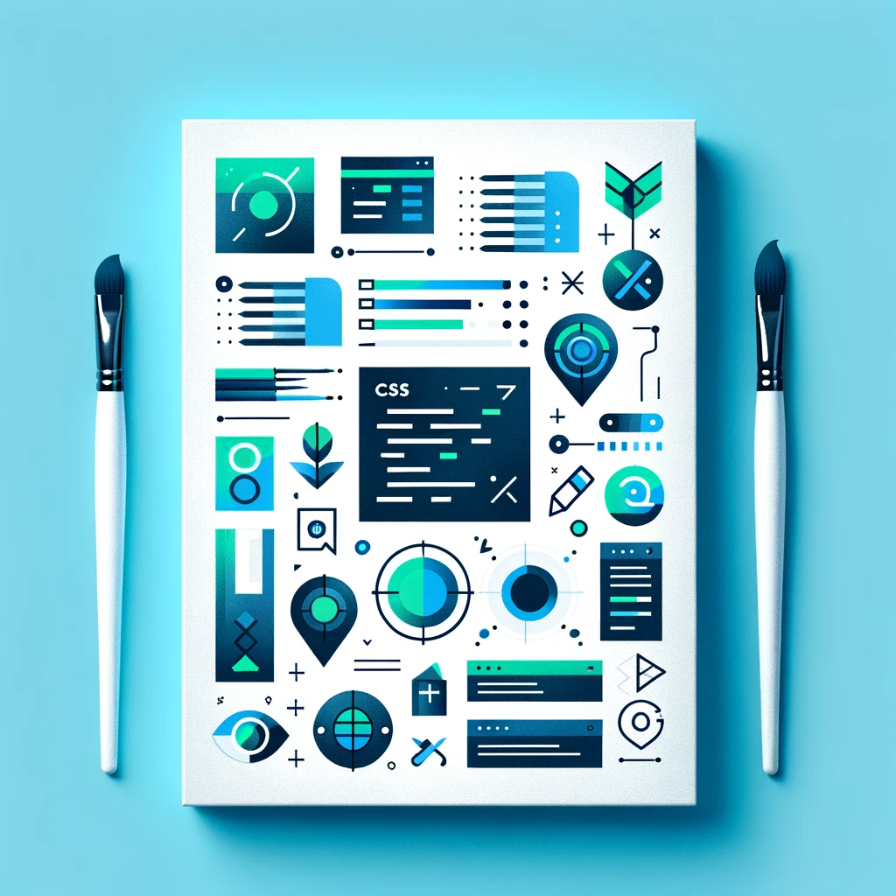
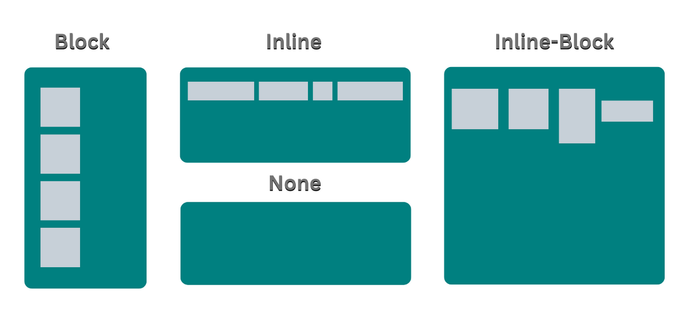
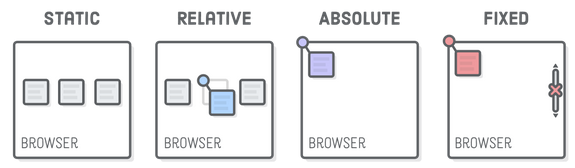
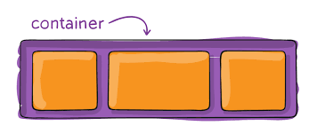
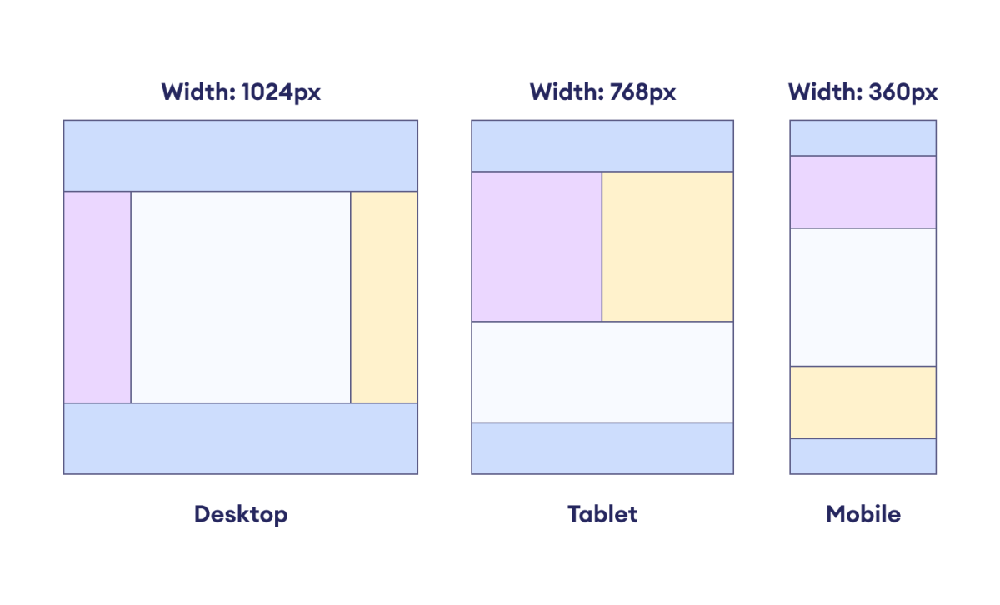
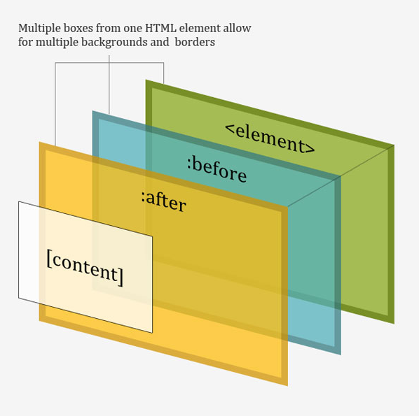
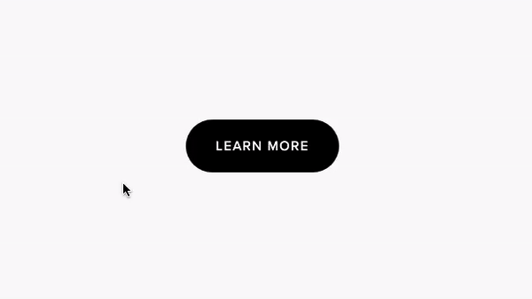

<!-- _class: titlepage -->



<div class="title">CSS Fundamentals</div>
<div class="subtitle">Modern Website Development</div>
<div class="author">R. Promkam, Dr.rer.nat.</div>
<div class="organization">Department of Mathematics and Computer Science, RMUTT</div>


---

<!-- _class: cool-list -->

# Agenda

1. *CSS Syntax and Selectors*
2. *Box Model and Layout Techniques*
3. *Responsive Design with Media Queries*
4. *Advanced Styling Techniques*
5. *Workshop Activities*
---

# CSS Syntax and Selectors

<div class="columns">
<div>

## CSS Syntax
- **Selectors**: Target HTML elements to apply styles.
- **Properties**: Define what aspect of the element to style.
- **Values**: Specify the style value for the property.

```css
selector {
    property: value;
}
``` 
 
</div>
<div>

## Example

```css
body {
    font-family: Arial, sans-serif;
    background-color: #f4f4f4;
}
```
</div>
</div>

---

# Types of Selectors

<div class="columns">
<div>
    
## Basic Selectors
- **Element Selector**: Targets HTML tags. 
    - Example: `p { color: blue; }`
- **Class Selector**: Targets elements with a specific class. 
    - Example: `.class-name { color: red; }`
- **ID Selector**: Targets an element with a specific ID. 
    - Example: `#id-name { color: green; }`
</div>
<div>
    
## Advanced Selectors
- **Attribute Selector**: Targets elements based on attributes. 
    - Example: `a[href] { color: purple; }`
- **Pseudo-class Selector**: Targets elements in a specific state. 
    - Example: `a:hover { color: orange; }`
</div>    
</div>

---

# Box Model

<div class="columns">
<div>
    
## What is the Box Model?
- **Content**: The actual content of the element.
- **Padding**: Space between the content and the border.
- **Border**: The border surrounding the padding (if any).
- **Margin**: Space outside the border.
</div>
<div>


    
```css
div {
    width: 100px;
    padding: 20px;
    border: 10px solid black;
    margin: 30px;
}
```
</div>
</div>

---

# Layout Techniques


## Display Property

<div class="columns">
<div>
    
- **block**: Element starts on a new line and takes up full width. 
    - Example: `div { display: block; }`
- **inline**: Element flows with text and only takes up as much width as needed. 
    - Example: `span { display: inline; }`
</div>
<div>
    
- **inline-block**: Like inline but can have width and height. 
    - Example: `img { display: inline-block; }`


</div>
</div>


---

# Layout Techniques

## Position Property

<div class="columns">
<div>

- **static**: Default position. Elements are positioned according to the normal flow. 
    - Example: `div { position: static; }`
- **relative**: Positioned relative to its normal position. 
    - Example: `div { position: relative; top: 10px; }`
</div>
<div>
    
- **absolute**: Positioned relative to the nearest positioned ancestor. 
    - Example: `div { position: absolute; top: 20px; }`
- **fixed**: Positioned relative to the viewport. 
    - Example: `div { position: fixed; top: 30px; }`
</div>
</div>



---

# Flexbox Layout

<div class="columns">
<div>

## What is Flexbox?
- A layout model that allows items to adjust and distribute space within a container.



</div>    
<div>

## Flex Container

```css
.container {
    display: flex;
    flex-direction: row;
    justify-content: space-between;
}
```
    
## Flex Items

```css
.item {
    flex: 1;
    margin: 10px;
}
```
</div>
</div>

---

# Grid Layout

<div class="columns">
<div>
    
## What is CSS Grid?
- A layout system for creating complex, responsive web designs.


</div>
<div>
    
## Grid Container

```css
.container {
    display: grid;
    grid-template-columns: repeat(3, 1fr);
    grid-gap: 10px;
}
```

## Grid Items

```css
.item {
    background-color: lightblue;
    padding: 20px;
}
```
</div>
</div>

---

# Responsive Design with Media Queries

<div class="columns">
<div>

## What are Media Queries?
- Allow the application of styles based on device characteristics like width, height, and orientation.

## Example

```css
@media (max-width: 600px) {
    body {
        background-color: lightgreen;
    }
}
```
</div>
<div>
    

</div>
</div>

---

# Advanced Styling Techniques



## Pseudo-elements
- **before**: Inserts content before an element.
- **after**: Inserts content after an element.

```css
p::before {
    content: "Note: ";
    font-weight: bold;
}
```
---

# Advanced Styling Techniques


    
## Transitions and Animations
- Smooth transitions between styles.

```css
button {
    transition: background-color 0.3s;
}
button:hover {
    background-color: blue;
}
```


---

<!-- _class: cool-list -->

# Workshop Activities

1. *Creating a Responsive Layout*
   - Build a responsive layout using Flexbox or Grid.
2. *Styling a Form*
   - Style an HTML form with various input types.
3. *Applying Advanced CSS Techniques*
   - Implement pseudo-elements, transitions, and animations.

---

# Creating a Responsive Layout

1. Create an HTML file with a basic structure.
2. Use Flexbox or Grid to create a responsive layout.
3. Ensure the layout adapts to different screen sizes using media queries.

---

```html
<!DOCTYPE html>
<html lang="en">
<head>
    <meta charset="UTF-8">
    <meta name="viewport" content="width=device-width, initial-scale=1.0">
    <title>Responsive Layout</title>
    <link rel="stylesheet" href="style.css">
</head>
<body>
    <header class="container">
        <div class="item">Logo</div>
        <nav class="item">Navigation</nav>
    </header>
    <main class="container">
        <section class="item">Content</section>
        <aside class="item">Sidebar</aside>
    </main>
    <footer class="container">
        <div class="item">Footer</div>
    </footer>
</body>
</html>
```

---

<div class="columns">
<div>
    
```css
body {
    font-family: Arial, sans-serif;
}

.container {
    display: flex;
    flex-wrap: wrap;
    justify-content: space-between;
    margin: 20px;
}

.item {
    flex: 1;
    margin: 10px;
    padding: 20px;
    border: 1px solid #ccc;
}

header, footer {
    background-color: #f4f4f4;
    padding: 20px;
    text-align: center;
}

```
</div>
<div>
    
```css

nav {
    background-color: #007BFF;
    color: white;
    padding: 10px;
}

nav a {
    color: white;
    text-decoration: none;
    margin: 0 10px;
}

nav a:hover {
    text-decoration: underline;
}
```    
</div>
</div>

---

# Styling a Form

1. Create a new HTML file with a form structure.
2. Apply CSS to style the form and its elements.

---

```html
<!DOCTYPE html>
<html lang="en">
<head>
    <meta charset="UTF-8">
    <meta name="viewport" content="width=device-width, initial-scale=1.0">
    <title>Styled Form</title>
    <link rel="stylesheet" href="style.css">
</head>
<body>
    <form>
        <label for="name">Name:</label>
        <input type="text" id="name" name="name" required>
        
        <label for="email">Email:</label>
        <input type="email" id="email" name="email" required>
        
        <label for="password">Password:</label>
        <input type="password" id="password" name="password" minlength="8" required>
        
        <input type="submit" value="Submit">
    </form>
</body>
</html>
```

---

<div class="columns">
<div>
    
```css
form {
    max-width: 600px;
    margin: 0 auto;
    padding: 20px;
    border: 1px solid #ccc;
    border-radius: 5px;
}

label {
    display: block;
    margin-bottom: 8px;
}
```
</div>
<div>

```css

input[type="text"],
input[type="email"],
input[type="password"] {
    width: 100%;
    padding: 8px;
    margin-bottom: 10px;
    border: 1px solid #ccc;
    border-radius: 4px;
}

input[type="submit"] {
    padding: 10px 15px;
    background-color: #007BFF;
    color: white;
    border: none;
    border-radius: 4px;
    cursor: pointer;
}

input[type="submit"]:hover {
    background-color: #0056b3;
}
```
</div>
</div>


---

# Applying Advanced CSS Techniques

1. Create an HTML file with elements to style.
2. Use pseudo-elements, transitions, and animations.

---

```html
<!DOCTYPE html>
<html lang="en">
<head>
    <meta charset="UTF-8">
    <meta name="viewport" content="width=device-width, initial-scale=1.0">
    <title>Advanced CSS</title>
    <link rel="stylesheet" href="style.css">
</head>
<body>
    <p>This is a paragraph with a pseudo-element.</p>
    <button>Hover over me!</button>
</body>
</html>
```

---

```css
p::before {
    content: "Note: ";
    font-weight: bold;
    color: red;
}

button {
    transition: background-color 0.3s;
}

button:hover {
    background-color: blue;
    color: white;
}
```

---

# Q&A

Feel free to ask any questions you have about the content covered today.

---

# Supplement Learning Resoures

<div class="columns">
<div>

<iframe width="90%" height="300px" src="https://www.youtube.com/embed/yfoY53QXEnI?si=5-LlS6iDz3gDgVkC" title="YouTube video player" frameborder="0" allow="accelerometer; autoplay; clipboard-write; encrypted-media; gyroscope; picture-in-picture; web-share" referrerpolicy="strict-origin-when-cross-origin" allowfullscreen></iframe>

</div>
<div>

## CSS Crash Course For Absolute Beginners

By Traversy Media.

A comprehensive overview of CSS, covering styles, selectors, and declarations. It includes a CSS cheat sheet for reference and a basic website layout tutorial using CSS3 basics.
</div>
</div>

---

# Supplement Learning Resoures

<div class="columns">
<div>

<iframe width="90%" height="300px" src="https://www.youtube.com/embed/zHUpx90NerM?si=SnmOv2fsisz9sS63" title="YouTube video player" frameborder="0" allow="accelerometer; autoplay; clipboard-write; encrypted-media; gyroscope; picture-in-picture; web-share" referrerpolicy="strict-origin-when-cross-origin" allowfullscreen></iframe>

</div>

<div>

## CSS3 Animation & Transitions Crash Course

By Traversy Media.

A beginner friendly crash course on CSS animation using keyframes as well as CSS transitions. We will do a little experimenting and we will build a small animated landing page project.
</div>
</div>

---

# Supplement Learning Resoures

<div class="columns">
<div>

<iframe width="90%" height="300px" src="https://www.youtube.com/embed/8MgpE2DTTKA?si=qjFQC3vu7lMCzBaf" title="YouTube video player" frameborder="0" allow="accelerometer; autoplay; clipboard-write; encrypted-media; gyroscope; picture-in-picture; web-share" referrerpolicy="strict-origin-when-cross-origin" allowfullscreen></iframe>

</div>
<div>

## Create a Website With Video Background

By Traversy Media.

Create a beautiful, custom landing page for a Travel website using HTML, CSS and a little JavaScript
</div>
</div>

---

# Supplement Learning Resoures

<div class="columns">
<div>

<iframe width="90%" height="300px" src="https://www.youtube.com/embed/1_ljUv6cvVE?si=w2yfXjrDSrYVMDFQ" title="YouTube video player" frameborder="0" allow="accelerometer; autoplay; clipboard-write; encrypted-media; gyroscope; picture-in-picture; web-share" referrerpolicy="strict-origin-when-cross-origin" allowfullscreen></iframe>

</div>
<div>

## HTML & CSS Mobile UI Layout

By Traversy Media.

Use HTML & CSS to build a mobile first layout. We will build a clone of the CVS app landing page and learn about the grid, flex, media queries and more.
</div>
</div>

---

# Supplement Learning Resoures

<div class="columns">
<div>

<iframe width="90%" height="300px" src="https://www.youtube.com/embed/3YW65K6LcIA?si=am5QiL4b7l3fSoVL" title="YouTube video player" frameborder="0" allow="accelerometer; autoplay; clipboard-write; encrypted-media; gyroscope; picture-in-picture; web-share" referrerpolicy="strict-origin-when-cross-origin" allowfullscreen></iframe>

</div>
<div>

## Flexbox Crash Course

By Traversy Media.

Flexbox is used for space distribution, positioning and alignment in CSS.
</div>
</div>

---

# Supplement Learning Resoures

<div class="columns">
<div>

<iframe width="90%" height="300px" src="https://www.youtube.com/embed/0xMQfnTU6oo?si=_dgN_-d-hpbnIEL-" title="YouTube video player" frameborder="0" allow="accelerometer; autoplay; clipboard-write; encrypted-media; gyroscope; picture-in-picture; web-share" referrerpolicy="strict-origin-when-cross-origin" allowfullscreen></iframe>

</div>
<div>

## CSS Grid Crash Course

By Traversy Media.

This crash course will teach you all of the fundamentals of CSS Grid
</div>
</div>


---

# Next Week

## Topic: JavaScript Basics
- Introduction to JavaScript
