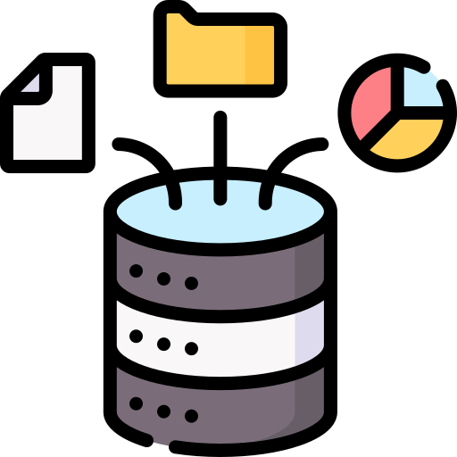
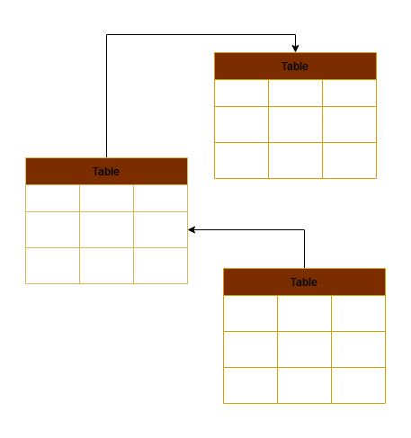
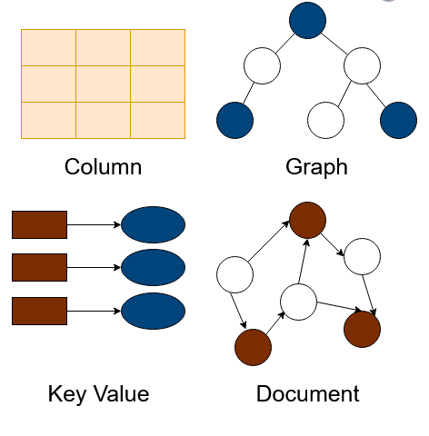

<!-- _class: titlepage -->


<div class="title">Database Integration</div>
<div class="subtitle">Modern Website Development</div>
<div class="author">R. Promkam, Dr.rer.nat.</div>
<div class="organization">Department of Mathematics and Computer Science, RMUTT</div>


---

<!-- _class: cool-list -->

# Agenda

1. *Introduction to Databases*
2. *SQL vs NoSQL*
3. *Introduction to PostgreSQL*
4. *CRUD Operations with PostgreSQL*
6. *Introduction to MongoDB*
7. *CRUD Operations with MongoDB*
9. *Workshop Activities*

---



# Introduction to Databases

## What is a Database?
- A structured collection of data.
- Allows for data storage, retrieval, and management.

## Use Cases
- Storing user information.
- Managing e-commerce products.
- Logging application events.

---

## Types of Databases

<div class="columns">
<div>

**Relational Databases (SQL)** 

Structured Query Language, table-based.
- Relational databases.
- Use SQL for querying.
- Tables with rows and columns.



- **Examples**: MySQL, PostgreSQL, SQLite.
</div>
<div>
   
**Non-Relational Databases (NoSQL)** 

Document-based, key-value pairs, graphs, wide-columns.
- Non-relational databases.
- Various data models: document, key-value, graph, column-family.



- **Examples**: MongoDB, Cassandra, Redis.

</div>
</div>

---

# SQL vs NoSQL

## When to Use
- **SQL**: Complex queries, transactions, structured data.
- **NoSQL**: Flexible schema, scalability, unstructured data.

---

# Introduction to PostgreSQL

## What is PostgreSQL?
- A powerful, open-source relational database system.
- Uses SQL for querying and managing data.
- Known for its robustness, extensibility, and standards compliance.

## Key Concepts
- **Database**: A collection of schemas.
- **Schema**: A namespace that contains tables, views, and other objects.
- **Table**: A collection of rows and columns.
- **Row**: A single record in a table.
- **Column**: A single field in a row.

---

# Setting Up PostgreSQL

## Installation

1. **Windows**: Download and install from [postgresql.org](https://www.postgresql.org/download/).
2. **Mac**: Install via Homebrew: `brew install postgresql`.
3. **Linux**: Install via package manager: `sudo apt-get install postgresql`.

## Running PostgreSQL

1. Start PostgreSQL server: `pg_ctl -D /usr/local/var/postgres start`.
2. Open the PostgreSQL interactive terminal: `psql`.

---

# CRUD Operations with PostgreSQL

## Creating a Database and Table

```sql
CREATE DATABASE mydatabase;
\c mydatabase
CREATE TABLE users (
    id SERIAL PRIMARY KEY,
    name VARCHAR(100),
    age INT
);
```

---

## Inserting Data

```sql
INSERT INTO users (name, age) VALUES ('Alice', 25);
INSERT INTO users (name, age) VALUES ('Bob', 30), ('Charlie', 35);
```

## Querying Data

```sql
SELECT * FROM users;
SELECT * FROM users WHERE name = 'Alice';
```

---

## Updating Data

```sql
UPDATE users SET age = 26 WHERE name = 'Alice';
UPDATE users SET status = 'active';
```

## Deleting Data

```sql
DELETE FROM users WHERE name = 'Alice';
DELETE FROM users WHERE status = 'active';
```

---

# Integrating PostgreSQL with an HTML Page

## Setting Up a Node.js Server

1. Initialize a new Node.js project and install necessary packages.

```bash
mkdir myapp
cd myapp
npm init -y
npm install express pg body-parser
```

---

2. Create a `server.js` file.

```javascript
const express = require('express');
const bodyParser = require('body-parser');
const { Pool } = require('pg');
const app = express();
const port = 3000;

const pool = new Pool({
    user: 'yourusername',
    host: 'localhost',
    database: 'mydatabase',
    password: 'yourpassword',
    port: 5432
});

app.use(bodyParser.json());
app.use(bodyParser.urlencoded({ extended: true }));

app.get('/', (req, res) => {
    res.sendFile(__dirname + '/index.html');
});

app.get('/users', async (req, res) => {
    try {
        const result = await pool.query('SELECT * FROM users');
        res.json(result.rows);
    } catch (err) {
        console.error(err);
        res.status(500).json({ error: 'Database error' });
    }
});

app.post('/users', async (req, res) => {
    const { name, age } = req.body;
    try {
        const result = await pool.query('INSERT INTO users (name, age) VALUES ($1, $2) RETURNING *', [name, age]);
        res.json(result.rows[0]);
    } catch (err) {
        console.error(err);
        res.status(500).json({ error: 'Database error' });
    }
});

app.listen(port, () => {
    console.log(`Server running on http://localhost:${port}`);
});
```

---

3. Create an `index.html` file.

```html
<!DOCTYPE html>
<html lang="en">
<head>
    <meta charset="UTF-8">
    <meta name="viewport" content="width=device-width, initial-scale=1.0">
    <title>PostgreSQL Integration</title>
</head>
<body>
    <h1>Users</h1>
    <form id="userForm">
        <input type="text" id="name" placeholder="Name">
        <input type="number" id="age" placeholder="Age">
        <button type="submit">Add User</button>
    </form>
    <ul id="userList"></ul>

    <script>
        document.getElementById('userForm').addEventListener('submit', async function(e) {
            e.preventDefault();
            const name = document.getElementById('name').value;
            const age = document.getElementById('age').value;

            const response = await fetch('/users', {
                method: 'POST',
                headers: {
                    'Content-Type': 'application/json'
                },
                body: JSON.stringify({ name, age })
            });
            const user = await response.json();
            document.getElementById('userList').innerHTML += `<li>${user.name} (${user.age})</li>`;
        });

        async function fetchUsers() {
            const response = await fetch('/users');
            const users = await response.json();
            const userList = document.getElementById('userList');
            userList.innerHTML = '';
            users.forEach(user => {
                userList.innerHTML += `<li>${user.name} (${user.age})</li>`;
            });
        }

        fetchUsers();
    </script>
</body>
</html>
```

---

# Introduction to MongoDB

## What is MongoDB?
- A NoSQL database.
- Document-oriented, stores data in JSON-like format.
- High performance, high availability, and easy scalability.

## Key Concepts
- **Database**: A container for collections.
- **Collection**: A group of MongoDB documents.
- **Document**: A record in a MongoDB collection, similar to a row in a SQL table.

---

# Setting Up MongoDB

## Installation

1. **Windows, Mac, Linux**: Follow instructions on [mongodb.com](https://www.mongodb.com/try/download/community).
2. Verify installation: `mongod --version`.

## Running MongoDB

1. Start MongoDB server: `mongod`.
2. Open a new terminal and start MongoDB shell: `mongo`.

---

# CRUD Operations with MongoDB

## Creating a Database and Collection

```javascript
use mydatabase
db.createCollection("users")
```

## Inserting Documents

```javascript
db.users.insertOne({ name: "Alice", age: 25 })
db.users.insertMany([
    { name: "Bob", age: 30 },
    { name: "Charlie", age: 35 }
])
```

## Querying Documents

```javascript
db.users.find()
db.users.find({ name: "Alice" })
```

## Updating Documents

```javascript
db.users.updateOne({ name: "Alice" }, { $set: { age: 26 } })
db.users.updateMany({}, { $set: { status: "active" } })
```

## Deleting Documents

```javascript
db.users.deleteOne({ name: "Alice" })
db.users.deleteMany({ status: "active" })
```

---

# Integrating MongoDB with an HTML Page

## Setting Up a Node.js Server

1. Initialize a new Node.js project and install necessary packages.

```bash
mkdir myapp
cd myapp
npm init -y
npm install express mongoose body-parser
```

2. Create a `server.js` file.

```javascript
const express = require('express');
const bodyParser = require('body-parser');
const mongoose = require('mongoose');
const app = express();
const port = 3000;

mongoose.connect('mongodb://localhost/mydatabase', { useNewUrlParser: true, useUnifiedTopology: true });

const userSchema = new mongoose.Schema({
    name: String,
    age: Number
});

const User = mongoose.model('User', userSchema);

app.use(bodyParser.json());
app.use(bodyParser.urlencoded({ extended: true }));

app.get('/', (req, res) => {
    res.sendFile(__dirname + '/index.html');
});

app.get('/users', async (

req, res) => {
    try {
        const users = await User.find();
        res.json(users);
    } catch (err) {
        console.error(err);
        res.status(500).json({ error: 'Database error' });
    }
});

app.post('/users', async (req, res) => {
    const { name, age } = req.body;
    try {
        const newUser = new User({ name, age });
        const savedUser = await newUser.save();
        res.json(savedUser);
    } catch (err) {
        console.error(err);
        res.status(500).json({ error: 'Database error' });
    }
});

app.listen(port, () => {
    console.log(`Server running on http://localhost:${port}`);
});
```

3. Create an `index.html` file.

```html
<!DOCTYPE html>
<html lang="en">
<head>
    <meta charset="UTF-8">
    <meta name="viewport" content="width=device-width, initial-scale=1.0">
    <title>MongoDB Integration</title>
</head>
<body>
    <h1>Users</h1>
    <form id="userForm">
        <input type="text" id="name" placeholder="Name">
        <input type="number" id="age" placeholder="Age">
        <button type="submit">Add User</button>
    </form>
    <ul id="userList"></ul>

    <script>
        document.getElementById('userForm').addEventListener('submit', async function(e) {
            e.preventDefault();
            const name = document.getElementById('name').value;
            const age = document.getElementById('age').value;

            const response = await fetch('/users', {
                method: 'POST',
                headers: {
                    'Content-Type': 'application/json'
                },
                body: JSON.stringify({ name, age })
            });
            const user = await response.json();
            document.getElementById('userList').innerHTML += `<li>${user.name} (${user.age})</li>`;
        });

        async function fetchUsers() {
            const response = await fetch('/users');
            const users = await response.json();
            const userList = document.getElementById('userList');
            userList.innerHTML = '';
            users.forEach(user => {
                userList.innerHTML += `<li>${user.name} (${user.age})</li>`;
            });
        }

        fetchUsers();
    </script>
</body>
</html>
```

---

# Workshop Activities

1. **Setting Up PostgreSQL and MongoDB**
   - Install and run PostgreSQL and MongoDB.
   - Create databases and tables/collections.
2. **CRUD Operations with PostgreSQL and MongoDB**
   - Perform insert, query, update, and delete operations.
3. **Integrating Databases with an HTML Page**
   - Set up a Node.js server to interact with PostgreSQL and MongoDB.
   - Create a front-end to display and manipulate data.

---

# Setting Up PostgreSQL and MongoDB Activity

1. Install PostgreSQL and MongoDB.
2. Start the PostgreSQL server.

```bash
pg_ctl -D /usr/local/var/postgres start
```

3. Start the MongoDB server.

```bash
mongod
```

4. Open the PostgreSQL interactive terminal.

```bash
psql
```

5. Open the MongoDB shell.

```bash
mongo
```

---

# CRUD Operations with PostgreSQL Activity

1. Create a database and table.

```sql
CREATE DATABASE mydatabase;
\c mydatabase
CREATE TABLE users (
    id SERIAL PRIMARY KEY,
    name VARCHAR(100),
    age INT
);
```

2. Insert data into the `users` table.

```sql
INSERT INTO users (name, age) VALUES ('Alice', 25);
INSERT INTO users (name, age) VALUES ('Bob', 30), ('Charlie', 35);
```

3. Query data from the `users` table.

```sql
SELECT * FROM users;
SELECT * FROM users WHERE name = 'Alice';
```

4. Update data in the `users` table.

```sql
UPDATE users SET age = 26 WHERE name = 'Alice';
UPDATE users SET status = 'active';
```

5. Delete data from the `users` table.

```sql
DELETE FROM users WHERE name = 'Alice';
DELETE FROM users WHERE status = 'active';
```

---

# CRUD Operations with MongoDB Activity

1. Insert documents into the `users` collection.

```javascript
db.users.insertOne({ name: "Alice", age: 25 })
db.users.insertMany([
    { name: "Bob", age: 30 },
    { name: "Charlie", age: 35 }
])
```

2. Query documents from the `users` collection.

```javascript
db.users.find()
db.users.find({ name: "Alice" })
```

3. Update documents in the `users` collection.

```javascript
db.users.updateOne({ name: "Alice" }, { $set: { age: 26 } })
db.users.updateMany({}, { $set: { status: "active" } })
```

4. Delete documents from the `users` collection.

```javascript
db.users.deleteOne({ name: "Alice" })
db.users.deleteMany({ status: "active" })
```

---

# Integrating PostgreSQL with an HTML Page Activity

1. Initialize a new Node.js project and install necessary packages.

```bash
mkdir myapp
cd myapp
npm init -y
npm install express pg body-parser
```

2. Create a `server.js` file and set up the Node.js server.

```javascript
const express = require('express');
const bodyParser = require('body-parser');
const { Pool } = require('pg');
const app = express();
const port = 3000;

const pool = new Pool({
    user: 'yourusername',
    host: 'localhost',
    database: 'mydatabase',
    password: 'yourpassword',
    port: 5432
});

app.use(bodyParser.json());
app.use(bodyParser.urlencoded({ extended: true }));

app.get('/', (req, res) => {
    res.sendFile(__dirname + '/index.html');
});

app.get('/users', async (req, res) => {
    try {
        const result = await pool.query('SELECT * FROM users');
        res.json(result.rows);
    } catch (err) {
        console.error(err);
        res.status(500).json({ error: 'Database error' });
    }
});

app.post('/users', async (req, res) => {
    const { name, age } = req.body;
    try {
        const result = await pool.query('INSERT INTO users (name, age) VALUES ($1, $2) RETURNING *', [name, age]);
        res.json(result.rows[0]);
    } catch (err) {
        console.error(err);
        res.status(500).json({ error: 'Database error' });
    }
});

app.listen(port, () => {
    console.log(`Server running on http://localhost:${port}`);
});
```

3. Create an `index.html` file to interact with the PostgreSQL database.

```html
<!DOCTYPE html>
<html lang="en">
<head>
    <meta charset="UTF-8">
    <meta name="viewport" content="width=device-width, initial-scale=1.0">
    <title>PostgreSQL Integration</title>
</head>
<body>
    <h1>Users</h1>
    <form id="userForm">
        <input type="text" id="name" placeholder="Name">
        <input type="number" id="age" placeholder="Age">
        <button type="submit">Add User</button>
    </form>
    <ul id="userList"></ul>

    <script>
        document.getElementById('userForm').addEventListener('submit', async function(e) {
            e.preventDefault();
            const name = document.getElementById('name').value;
            const age = document.getElementById('age').value;

            const response = await fetch('/users', {
                method: 'POST',
                headers: {
                    'Content-Type': 'application/json'
                },
                body: JSON.stringify({ name, age })
            });
            const user = await response.json();
            document.getElementById('userList').innerHTML += `<li>${user.name} (${user.age})</li>`;
        });

        async function fetchUsers() {
            const response = await fetch('/users');
            const users = await response.json();
            const userList = document.getElementById('userList');
            userList.innerHTML = '';
            users.forEach(user => {
                userList.innerHTML += `<li>${user.name} (${user.age})</li>`;
            });
        }

        fetchUsers();
    </script>
</body>
</html>
```

---

# Integrating MongoDB with an HTML Page Activity

1. Initialize a new Node.js project and install necessary packages.

```bash
mkdir myapp
cd myapp
npm init -y
npm install express mongoose body-parser
```

2. Create a `server.js` file and set up the Node.js server.

```javascript
const express = require('express');
const bodyParser = require('body-parser');
const mongoose = require('mongoose');
const app = express();
const port = 3000;

mongoose.connect('mongodb://localhost/mydatabase', { useNewUrlParser: true, useUnifiedTopology: true });

const userSchema = new mongoose.Schema({
    name: String,
    age: Number
});

const User = mongoose.model('User', userSchema);

app.use(bodyParser.json());
app.use(bodyParser.urlencoded({ extended: true

 }));

app.get('/', (req, res) => {
    res.sendFile(__dirname + '/index.html');
});

app.get('/users', async (req, res) => {
    try {
        const users = await User.find();
        res.json(users);
    } catch (err) {
        console.error(err);
        res.status(500).json({ error: 'Database error' });
    }
});

app.post('/users', async (req, res) => {
    const { name, age } = req.body;
    try {
        const newUser = new User({ name, age });
        const savedUser = await newUser.save();
        res.json(savedUser);
    } catch (err) {
        console.error(err);
        res.status(500).json({ error: 'Database error' });
    }
});

app.listen(port, () => {
    console.log(`Server running on http://localhost:${port}`);
});
```

3. Create an `index.html` file to interact with the MongoDB database.

```html
<!DOCTYPE html>
<html lang="en">
<head>
    <meta charset="UTF-8">
    <meta name="viewport" content="width=device-width, initial-scale=1.0">
    <title>MongoDB Integration</title>
</head>
<body>
    <h1>Users</h1>
    <form id="userForm">
        <input type="text" id="name" placeholder="Name">
        <input type="number" id="age" placeholder="Age">
        <button type="submit">Add User</button>
    </form>
    <ul id="userList"></ul>

    <script>
        document.getElementById('userForm').addEventListener('submit', async function(e) {
            e.preventDefault();
            const name = document.getElementById('name').value;
            const age = document.getElementById('age').value;

            const response = await fetch('/users', {
                method: 'POST',
                headers: {
                    'Content-Type': 'application/json'
                },
                body: JSON.stringify({ name, age })
            });
            const user = await response.json();
            document.getElementById('userList').innerHTML += `<li>${user.name} (${user.age})</li>`;
        });

        async function fetchUsers() {
            const response = await fetch('/users');
            const users = await response.json();
            const userList = document.getElementById('userList');
            userList.innerHTML = '';
            users.forEach(user => {
                userList.innerHTML += `<li>${user.name} (${user.age})</li>`;
            });
        }

        fetchUsers();
    </script>
</body>
</html>
```

---

# Q&A

Feel free to ask any questions you have about the content covered today.

---

# Next Week

## Topic: Authentication and Authorization
- User Authentication Concepts
- JWT (JSON Web Tokens)
- Role-Based Access Control

See you next week!


