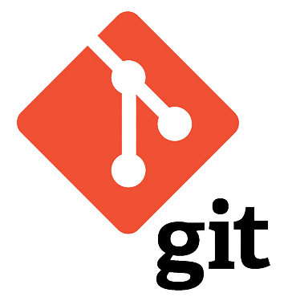

<!-- _class: titlepage -->


<div class="title">Version Control with Git</div>
<div class="subtitle">Modern Website Development</div>
<div class="author">R. Promkam, Dr.rer.nat.</div>
<div class="organization">Department of Mathematics and Computer Science, RMUTT</div>


---

<!-- _class: cool-list -->

# Agenda

1. *Introduction to Version Control*
2. *Basics of Git*
3. *Working with GitHub*
4. *Git Commands*
5. *Branching and Merging*
6. *Workshop Activities*

---

# Introduction to Version Control

## What is Version Control?
- A system that records changes to files over time.
- Allows you to revert to specific versions.
- Facilitates collaboration among multiple developers.

## Benefits
- Keeps a history of changes.
- Enables collaboration.
- Helps in tracking and managing code versions.
- Facilitates continuous integration and deployment.

---




# Basics of Git 

- A distributed version control system.
- Created by Linus Torvalds in 2005.

## Key Concepts
- **Repository**: A storage for your project.
- **Commit**: A snapshot of your changes.
- **Branch**: A parallel version of your repository.
- **Merge**: Combining branches together.

---

# Setting Up Git

## Installation

1. **Windows**: Download from [git-scm.com](https://git-scm.com/).
2. **Mac**: Install via Homebrew: `brew install git`.
3. **Linux**: Install via package manager: `sudo apt-get install git`.

## Configuration

```bash
git config --global user.name "Your Name"
git config --global user.email "your.email@example.com"
```

---

# Working with GitHub

## What is GitHub?
- A web-based platform for version control and collaboration.
- Hosts Git repositories.

## Creating a Repository

1. Sign up on [GitHub](https://github.com/).
2. Create a new repository.
3. Clone the repository to your local machine.

```bash
git clone https://github.com/yourusername/your-repo.git
```

---

# Git Commands

<div class="columns">
<div>

## Initializing a Repository
- `git init`: Initializes a new Git repository.

## Staging and Committing
- `git add <filename>`: Stages a file.
- `git commit -m "Commit message"`: Commits the staged changes.

</div>
<div>

## Pushing Changes

- `git push origin <branch-name>`: Pushes commits to the remote repository.

## Viewing History
- `git log`: Shows commit history.
    
</div>
</div>

---

## Example Workflow

```bash
git init
git add .
git commit -m "Initial commit"
git push origin main
git log

```

---

# Reverting Changes

## When to Use git revert

- Use `git revert` to undo changes without rewriting commit history.
- It creates a new commit that reverses the changes of a specific commit.

### Example

```bash
git revert <commit-id>
```

- This command will open the default text editor to confirm the commit message for the revert.
- Save and close the editor to complete the revert.


---


# Branching and Merging

## What is a Branch?
- A branch is a parallel version of your repository.
- Allows you to work on different features simultaneously.


---

## Creating and Switching Branches

```bash
git branch <branch-name>
git checkout <branch-name>
```

## Merging Branches

```bash
git checkout main
git merge <branch-name>
```

## Handling Merge Conflicts
- Occur when changes from different branches conflict.
- Git will prompt you to resolve conflicts manually.

---

# Workshop Activities

1. **Setting Up Git**
   - Install and configure Git.
2. **Creating a Local Repository**
   - Initialize a new Git repository and make initial commits.
3. **Working with GitHub**
   - Create a GitHub repository and clone it locally.
4. **Branching and Merging**
   - Create new branches, switch between them, and merge changes.

---

# Setting Up Git Activity

1. Install Git on your machine.
2. Configure your Git username and email.

```bash
git config --global user.name "Your Name"
git config --global user.email "your.email@example.com"
```

---

# Creating a Local Repository Activity

1. Create a new directory for your project.
2. Initialize a new Git repository.

```bash
mkdir my-project
cd my-project
git init
```

3. Create a new file and make your first commit.

```bash
echo "# My Project" > README.md
git add README.md
git commit -m "Initial commit"
```

---

# Working with GitHub Activity

1. Create a new repository on GitHub.
2. Clone the repository to your local machine.

```bash
git clone https://github.com/yourusername/your-repo.git
cd your-repo
```

3. Make changes, commit, and push to GitHub.

```bash
echo "Some changes" >> README.md
git add README.md
git commit -m "Update README"
git push origin main
```

---

# Branching and Merging Activity

1. Create and switch to a new branch.

```bash
git branch new-feature
git checkout new-feature
```

2. Make changes and commit them.

```bash
echo "New feature" >> feature.txt
git add feature.txt
git commit -m "Add new feature"
```

3. Merge the new branch into the main branch.

```bash
git checkout main
git merge new-feature
```

4. Handle any merge conflicts that arise.

---

# Q&A

Feel free to ask any questions you have about the content covered today.

---

# Supplement Learning Resoures

<div class="columns">
<div>

<iframe width="90%" height="100%" src="https://www.youtube.com/embed/SWYqp7iY_Tc?si=zLvMK1S9Pi9UFkB7" title="YouTube video player" frameborder="0" allow="accelerometer; autoplay; clipboard-write; encrypted-media; gyroscope; picture-in-picture; web-share" referrerpolicy="strict-origin-when-cross-origin" allowfullscreen></iframe>
</div>
<div>

## Git & GitHub Crash Course For Beginners

By Traversy Media.

Work with all the basic and most important commands such as add, commit, status, push and more. This tutorial is very beginner friendly.
</div>
</div>

---


# Next Week

## Topic: Introduction to Backend Development
- Overview of Backend Technologies
- Introduction to Node.js and Express.js
- RESTful API Design

See you next week!

