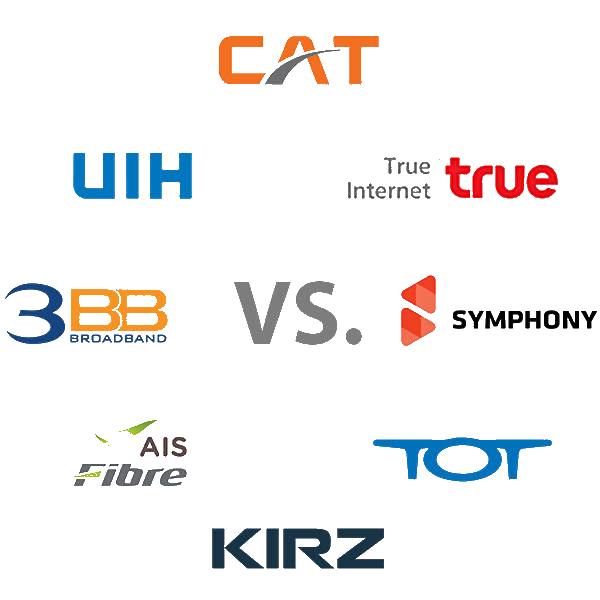
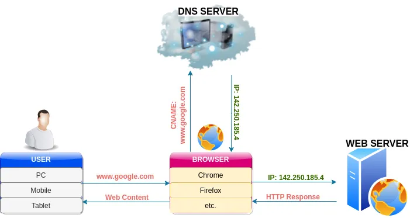
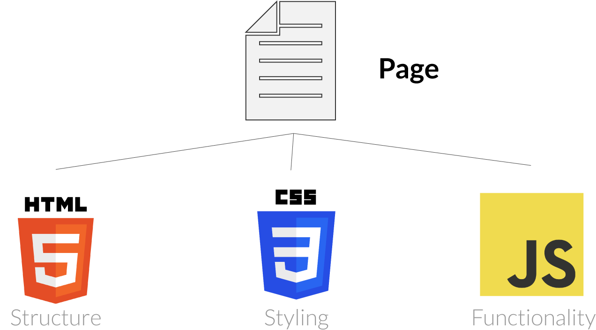

<!-- _class: titlepage -->


<div class="title">Introduction to Modern Web Development</div>
<div class="subtitle">Modern Website Development</div>
<div class="author">R. Promkam, Dr.rer.nat.</div>
<div class="organization">Department of Mathematics and Computer Science, RMUTT</div>


---

<!-- _class: cool-list -->

# Agenda

1. *The Internet & Websites*
1. *Overview of Web Development*
1. *Introduction to Web Technologies*
1. *Setting Up Development Environment*
1. *Workshop Activities*

---

# What is the Internet?

- A global network of interconnected computers.
- Enables communication and data exchange worldwide.
- Consists of millions of private, public, academic, business, and government networks.

---

# How Data Travels on the Internet

1. **Data Packets**: Information is broken into smaller packets.
2. **Routing**: Packets travel through various routers to reach the destination.
3. **Reassembly**: At the destination, packets are reassembled into the original data.

---

# Key Components of the Internet

<div class="columns">

<div>

## Clients
Request and use services provided by servers (browsers, apps).

</div>

<div>

## Switches
Connect devices within a local network and manage data flow.
</div>

<div>

## Routers
Direct data packets to their destination across networks.
</div>

<div>

## Servers
Provide resources and services (websites, data storage).

</div>


</div>

---

# Network Protocols

<div class="columns">
<div>

## TCP/IP 
(Transmission Control Protocol/Internet Protocol)

- Fundamental protocols for data transmission.
- **TCP**: Ensures reliable delivery of data packets.
- **IP**: Routes packets to their destination.

</div>
<div>

## HTTP/HTTPS
(HyperText Transfer Protocol/Secure)

- Protocols for transferring web pages.
- **HTTP**: Standard protocol.
- **HTTPS**: Secure, encrypted version.

</div>
</div>

---

# Domain Names and IP Addresses

<div class="columns">
<div>
    
## IP Address
- Unique numerical address for each device on the network.
- Example: `192.168.1.1`</div>
<div>
    
## Domain Name
- Human-readable address for websites.
- Example: `www.example.com`

## DNS (Domain Name System)
- Translates domain names to IP addresses.
- Like a phone book for the internet.
</div>
</div>

---

# Internet Service Providers (ISPs)



- Companies that provide internet access to users.
- Examples: 3BB, True Internet, AIS Fibre, etc.
- Connect users to the broader internet network.


---

<!-- # How Internet Works -->




---


# Overview of Web Development

## Frontend Development
- Focuses on the visual and interactive aspects of a website.
- Technologies: HTML, CSS, JavaScript

## Backend Development
- Manages server-side operations and database interactions.
- Technologies: Node.js, Python, SQL/NoSQL Databases

## Full-stack Development
- Combines both frontend and backend development skills.

---

# Introduction to Web Technologies

<div class="columns">
<div>

## HTML (HyperText Markup Language)

- Structure of web pages.
- Defines elements such as headings, paragraphs, links, and images. 

## CSS (Cascading Style Sheets)
- Styling of web pages.
- Manages layout, colors, fonts, and responsiveness.
</div>
<div>

## JS (JavaScript)
- Adds interactivity to web pages.
- Handles events, animations, and API calls. 

     

</div>
</div>


---
 

<!-- 
_class: cool-list 
-->

# Workshop Activities

1. *Installing Development Tools*
   - Install VSCode, Node.js, and Git.
2. *Basic HTML and CSS Structure*
   - Create a simple web page with HTML and CSS.
3. *Creating a Simple Web Page*
   - Hands-on practice to reinforce lecture concepts.

---

# Installing Development Tools


<div class="columns">
<div>

## Text Editors

 

- Sublime Text
    - Open [sublimetext.com](https://www.sublimetext.com/download)
- Visual Studio Code (VSCode)
    - Open [code.visualstudio.com](https://code.visualstudio.com/)
- Download and install for your operating system.
</div>
<div>
    
## Node.js
- JavaScript runtime.
- Open [nodejs.org](https://nodejs.org/)
- Download the LTS version and install.

## Git
- Version control system.
- Open [git-scm.com](https://git-scm.com/)
- Download and install for your operating system.
</div>
</div>

---

# Basic HTML Structure

```html
<!DOCTYPE html>
<html lang="en">
<head>
    <meta charset="UTF-8">
    <meta name="viewport" content="width=device-width, initial-scale=1.0">
    <title>My First Web Page</title>
    <link rel="stylesheet" href="style.css">
</head>
<body>
    <h1>Hello, World!</h1>
    <p>This is my first web page.</p>
</body>
</html>
```

---

# Basic CSS Structure

```css
body {
    font-family: Arial, sans-serif;
    margin: 0;
    padding: 0;
    background-color: #fa8072;
}

h1 {
    color: #72ecfa;
    text-align: center;
}

p {
    font-size: 18px;
    text-align: center;
}
```
---

# Creating a Simple Web Page

1. Create a new folder for your project.
1. Inside the folder, create an `index.html` file and a `style.css` file.
1. Copy the basic HTML and CSS structures from the slides into these files.
1. Open `index.html` in a web browser to see your first web page!


---

# Next Week

## Topic: HTML Fundamentals

Deep dive into HTML elements and attributes.
Semantic HTML and best practices.
See you next week!
