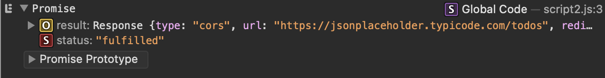
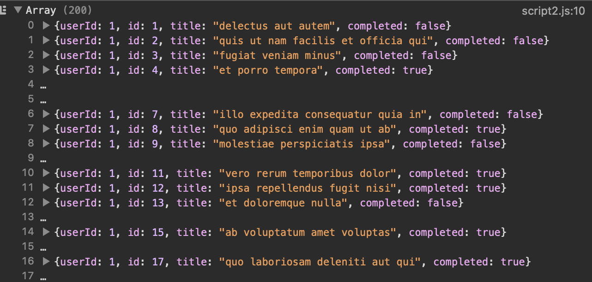
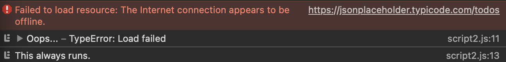

<!-- _class: titlepage -->


<div class="title">Advanced JavaScript</div>
<div class="subtitle">Modern Website Development</div>
<div class="author">R. Promkam, Dr. rer. nat.</div>
<div class="organization">Department of Mathematics and Computer Science, RMUTT</div>


---

<!-- _class: cool-list -->

# Agenda

1. *DOM Manipulation*
2. *Advanced Functions*
3. *Asynchronous JavaScript*
4. *Workshop Activities*

---

# DOM Manipulation


## What is the DOM?
- The Document Object Model (DOM) represents the structure of a web page.
- JavaScript can interact with and manipulate the DOM to change the content and structure of a web page.

---

# Selecting Elements
- **getElementById**: Selects an element by its ID.
- **getElementsByClassName**: Selects elements by their class name.
- **querySelector**: Selects the first element that matches a CSS selector.

## Examples

```javascript
// Select by ID
let title = document.getElementById('title');

// Select by class name
let items = document.getElementsByClassName('item');

// Select by CSS selector
let firstItem = document.querySelector('.item');
```

---

# Manipulating Elements

<div class="columns">
<div>
    
## Changing Content
- **innerHTML**: Changes the HTML content of an element.
- **innerText**: Like innerHTML but ignores HTML tags and hidded elements.
- **textContent**: Like innerText but leaves styles even they are hidden.

## Changing Styles
- **style.property**: Changes the CSS style of an element.
</div>
<div>
    
## Examples

```javascript
// Change content
title.innerHTML = 'New Title';
firstItem.textContent = 'First Item';

// Change style
firstItem.style.color = 'blue';
firstItem.style.fontSize = '20px';
```
</div>
</div>

---

<div class='columns'>
<div>

# Example: **innerHTML**
```html
<nav>
  <a>Home</a>
  <a>About</a>
  <a>Contact</a>
  <a style="display: none">Pricing</a>
</nav>
```
```JavaScript
// Reading content with innerHTML
const navElement = document.querySelector('nav')
```

```JavaScript
console.log(navElement.innerHTML)
```
</div>
<div>

## Output
```Console
<a>Home</a>
<a>About</a>
<a>Contact</a>
‹a style="display: none">Pricing</a>
```
</div>
</div>

---


<div class='columns'>
<div>

# Example: **innerText**
```html
<nav>
  <a>Home</a>
  <a>About</a>
  <a>Contact</a>
  <a style="display: none">Pricing</a>
</nav>
```
```JavaScript
// Reading content with innerHTML
const navElement = document.querySelector('nav')
```

```JavaScript
console.log(navElement.innerText)
```
</div>
<div>

## Output
```Console
Home About Contact
```
</div>
</div>

---


<div class='columns'>
<div>

# Example: **textContent**
```html
<nav>
  <a>Home</a>
  <a>About</a>
  <a>Contact</a>
  <a style="display: none">Pricing</a>
</nav>
```
```JavaScript
// Reading content with innerHTML
const navElement = document.querySelector('nav')
```

```JavaScript
console.log(navElement.textContent)
```
</div>
<div>

## Output
```Console
Home
About
Contact
Pricing
```
</div>
</div>

---


# Creating and Removing Elements

<div class="columns">
<div>
    
## Creating Elements
- **createElement**: Creates a new HTML element.
- **appendChild**: Adds a new child element to a parent element.

## Removing Elements
- **removeChild**: Removes a child element from a parent element.
</div> 
<div>
    
### Examples

```javascript
// Create a new element
let newItem = document.createElement('li');
newItem.textContent = 'New Item';


// Add the new element to the list
let list = document.getElementById('list');
list.appendChild(newItem);


// Remove the first item from the list
list.removeChild(firstItem);
```
</div>
</div> 

---

# Advanced Functions

<div class="columns">
<div>

## Arrow Functions
- A shorter syntax for writing functions.
- Does not have its own `this` context.

## Example

```javascript
// Regular function
function add(a, b) {
    return a + b;
}

// Arrow function
const add = (a, b) => a + b;
```
</div>
<div>
    
## Higher-Order Functions
- Functions that take other functions as arguments or return functions.

## Example

```javascript
function greet(name) {
    return function(message) {
        console.log(message + ', ' + name);
    }
}


const greetAlice = greet('Alice');
greetAlice('Hello'); // Output: Hello, Alice
```    
</div>
</div>

---

# Asynchronous JavaScript

<div class='columns'>
<div>

## Synchronous Code
```javascript
let greet_one = "Hello"
let greet_two = "World!!!"

console.log(greet_one)

for(let i=0;i<1000000000;i++){

}

console.log(greet_two);
```
</div>
<div>
   
## Asynchronous Code
```javascript
let greet_one = "Hello"
let greet_two = "World!!!"

console.log(greet_one)

setTimeout(function(){
    console.log("Asynchronous");
}, 10000)

console.log(greet_two);
```    
</div>
</div>

---

# Callbacks

<div class='columns'>
<div>

A callback function is a function passed into another function as an argument, which is then invoked inside the outer function to complete some kind of routine or action.
    
</div>
<div>
    
```javascript
function add(x,y){
    return x+y
}

function divide(x,y){
    return x/y
}

function compute(callBack, x, y){
    return callBack(x,y)
}

console.log(compute(add, 10, 5))
console.log(compute(divide, 10, 5))
```
</div>
</div>


---

# Callback Hell

<div class='columns'>
<div>

```javascript
setTimeout(() =>{
    console.log("One Second");
    setTimeout(() =>{
        console.log("Two Seconds");
        setTimeout(() =>{
            console.log("Three Seconds");
            setTimeout(() =>{
                console.log("Four Seconds");
                setTimeout(() =>{
                    console.log("Five Seconds");
                }, 1000)
            }, 1000)
        }, 1000)
    }, 1000)
}, 1000)
```    
</div>
<div>
    
```javascript
function logTime() {
    x++;
    text = 'Passed ' + x + ' secs.'
    console.log(text)
    setTimeout(logTime, 1000);
}

var x = 0;
logTime()
```
</div>
</div>

---

# Promises

<div class='columns'>
<div>

- A promise is placeholder for the future result of an asynchronous operation.
- When using promises, we don't need to relay on callbacks which helps us avoid callback hell.
- Promises are like lottery ticket. When we buy a lottery ticket, it says we will get money if our outcome is right.

</div>
<div>
    
```javascript
const url = 'https://jsonplaceholder.typicode.com/todos'
```
```javascript
const request = fetch(url)
console.log(request)

```



</div>
</div>

---

# Consume Promises

<div class='columns'>
<div>

- We make a request, we wait for the result. 
- Then after result arrives, we perform some operation on those results.

``` javascript
const url = 'https://jsonplaceholder.typicode.com/todos'
``` 
``` javascript
const request = fetch(url)
const response = request.then((r) => {
    console.log(r);
    return r.json();
})
``` 
</div>
<div>

``` javascript
response.then((data) => {
    console.log(data);
})
``` 

    

</div>
</div>

---

# Handle Rejected Promises

<div class='columns'>
<div>

- In real world situations, there could be times when our app crashes due to not handling rejected promises properly.

``` javascript
const url = 'https://jsonplaceholder.typicode.com/todos'
``` 
``` javascript
const request = fetch(url)
const response = request.then((r) => {
    console.log(r);
    return r.json();
})
``` 
</div>
<div>

``` javascript
response.then((data) => {
    console.log(data);
}).catch((error) => {
    console.log('Oops...', error);
}).finally(() => {
    console.log('This always runs.')
});
``` 

    

</div>
</div>

---

# Create a Promise

- Promises are asynchronous in nature. Once we know how to create promises, we can make any piece of code asynchronous. 
- Then it will not block code execution if the other code running is taking a long time to complete.

<div class='columns'>
<div>
    
```javascript
let lottery = new Promise(
    function(resolve, reject){
        console.log("Lottery is happening");

        setTimeout(() => {    
            if(Math.random() >= 0.5){
                resolve("You Won!!!")
            }
            else{
                reject(new Error("Bad luck"))
            }   
        }, 1000);
    }
)
```
</div>
<div>
    
```javascript
lottery.then((response) =>{
    console.log(response);
}).catch((err) =>{
    console.log(err);
})

```  
</div>
</div>


---

# Consume Promises using async/await

- async/await is easy to use.
- chaining the `then()` method could be very long and gets complex.


```javascript
async function fetchAPI () {
    const url = 'https://cat-fact.herokuapp.com/facts';
    const res = await fetch(url);
    const data = await res.json();
    console.log(data);
}
fetchAPI()
console.log("FIRST");
```

---

# Handle Errors with async/await

```javascript
async function fetchAPI () {
    try{
        const url = 'https://cat-fact.herokuapp.com/facts';
        const res = await fetch(url);
        if(!res.ok){
            throw new Error("Custom Error");
        }
        const data = await res.json();
        console.log(data);
    } catch(err){
        console.log(err);
    }
}

fetchAPI();
console.log("FIRST");

```
---

# Return Values from Async Functions

<div class='columns'>
<div>
    
```javascript
async function fetchAPI() {
    try{
        const url = 'https://cat-fact.herokuapp.com/facts';
        const res = await fetch(url);
        if(!res.ok){
            throw new Error("Custom Error")
        }
        const data = await res.json()
        console.log(data);
        return "Done with fetchAPI"
    } catch(err){
        console.log(err);
        throw new Error("Custom Error")
    }
}

```
</div>
<div>
    
```javascript
fetchAPI().then((msg) =>{
    console.log(msg);
}).catch((err) =>{
    console.log(err);
})
```   
</div>
</div>

---

# Run Promises in Parallel

```javascript
async function fetchAPI(country1,country2,country3){
    try{
        const res1 = await fetch(`https://restcountries.com/v3.1/name/${country1}`)
        const res2 = await fetch(`https://restcountries.com/v3.1/name/${country2}`)
        const res3 = await fetch(`https://restcountries.com/v3.1/name/${country3}`)
        
        const data1 = await res1.json()
        const data2 = await res2.json()
        const data3 = await res3.json()
        console.log(data1[0].capital[0]);
        console.log(data2[0].capital[0]);
        console.log(data3[0].capital[0]);
        return "Done with fetchAPI"
    } catch(err){
        console.log(err);
        throw new Error("Custom Error")
    }
}

fetchAPI("canada", "germany", "russia")
```
---

# Use Promise.all()

- With the help of **Promise.all()**, we can run multiple promises in parallel which will boost performance. 
- The **promise.all()** takes an array as an argument which are promises and run them in parallel.

```javascript
let promise1 = new Promise((resolve) =>{
    setTimeout(() =>{
       resolve("First Promise")
    }, 2000)
})

let promise2 = Promise.resolve("Second Promise")

let returnedPromises = Promise.all([promise1,promise2]).then((res) =>{
    console.log(res);
})
```

---

# Workshop Activities

1. **DOM Manipulation**
   - Practice selecting and manipulating DOM elements.
2. **Advanced Functions**
   - Implement arrow functions and higher-order functions.
3. **Asynchronous JavaScript**
   - Work with callbacks, Promises, and async/await.

---

# DOM Manipulation Activity

1. Create an HTML file with a list of items.
2. Write JavaScript to:
   - Select the list and its items.
   - Change the content and style of the first item.
   - Add a new item to the list.
   - Remove the last item from the list.

---

```html
<!DOCTYPE html>
<html lang="en">
<head>
    <meta charset="UTF-8">
    <meta name="viewport" content="width=device-width, initial-scale=1.0">
    <title>DOM Manipulation</title>
</head>
<body>
    <h1 id="title">Item List</h1>
    <ul id="list">
        <li class="item">Item 1</li>
        <li class="item">Item 2</li>
        <li class="item">Item 3</li>
    </ul>
    <script src="script.js"></script>
</body>
</html>
```

---

```javascript
// Select elements
let title = document.getElementById('title');
let list = document.getElementById('list');
let items = document.getElementsByClassName('item');

// Change content and style
items[0].textContent = 'Updated Item 1';
items[0].style.color = 'blue';

// Add new item
let newItem = document.createElement('li');
newItem.textContent = 'New Item';
list.appendChild(newItem);

// Remove last item
list.removeChild(items[items.length - 1]);
```

---

# Advanced Functions Activity

1. Write a higher-order function that takes a function and a value as arguments.
2. The higher-order function should return a new function that calls the original function with the value.

```javascript
function multiplyBy(factor) {
    return function(number) {
        return number * factor;
    }
}

const double = multiplyBy(2);
console.log(double(5)); // Output: 10
```

---

# Asynchronous JavaScript Activity

1. Create a function that simulates fetching data with a Promise.
2. Use async/await to call the function and log the result.

```javascript
function fetchData() {
    return new Promise((resolve, reject) => {
        setTimeout(() => {
            resolve('Data loaded');
        }, 2000);
    });
}

async function loadData() {
    let data = await fetchData();
    console.log(data); // Output: Data loaded
}

loadData();
```

---

# Q&A

Feel free to ask any questions you have about the content covered today.

---

# Next Week

## Topic: Version Control with Git
- Introduction to Git and GitHub
- Basic Git Commands
- Branching and Merging

See you next week!
