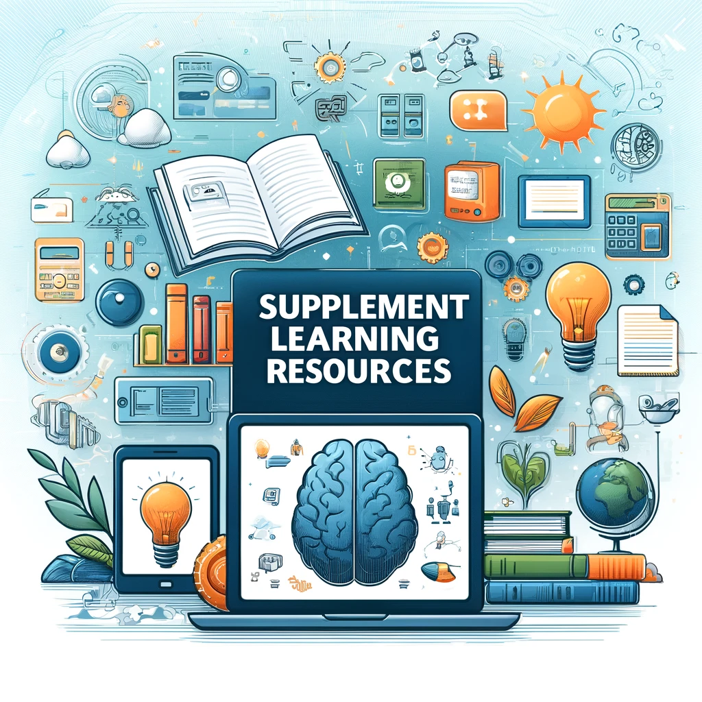
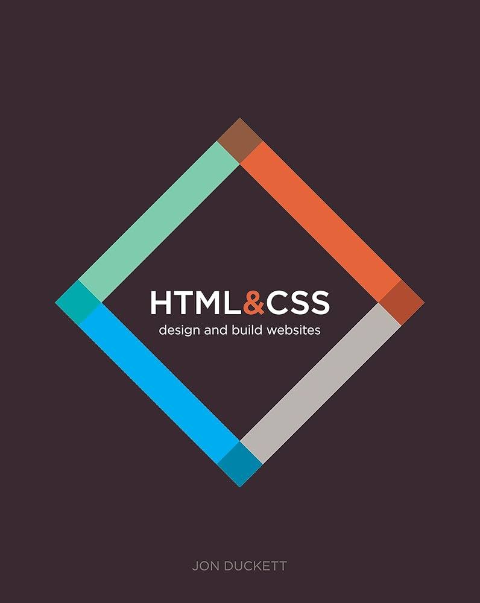
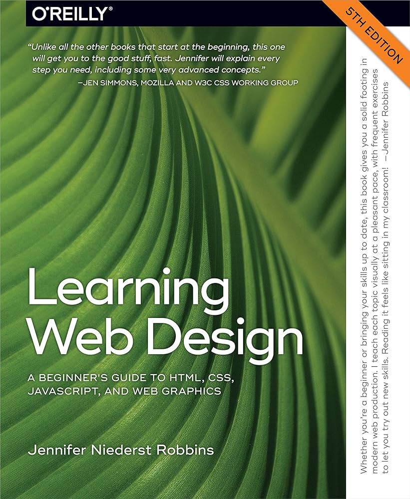
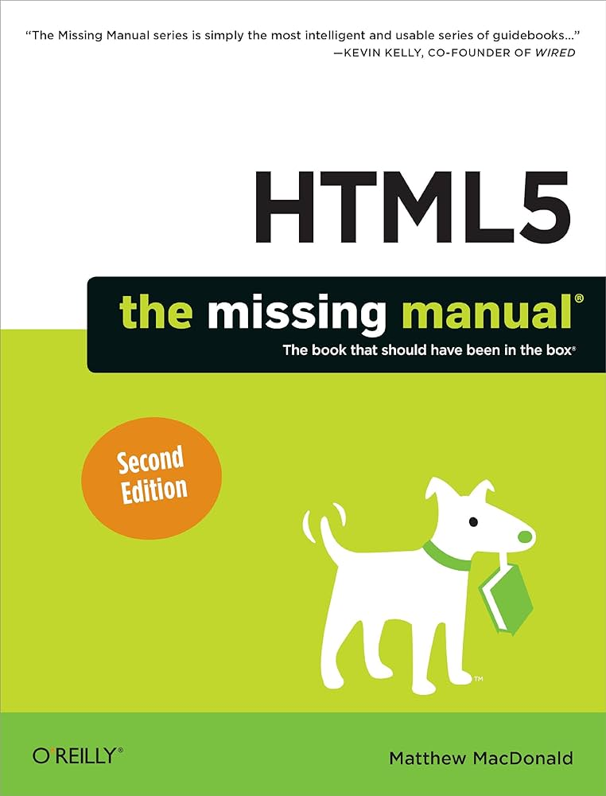
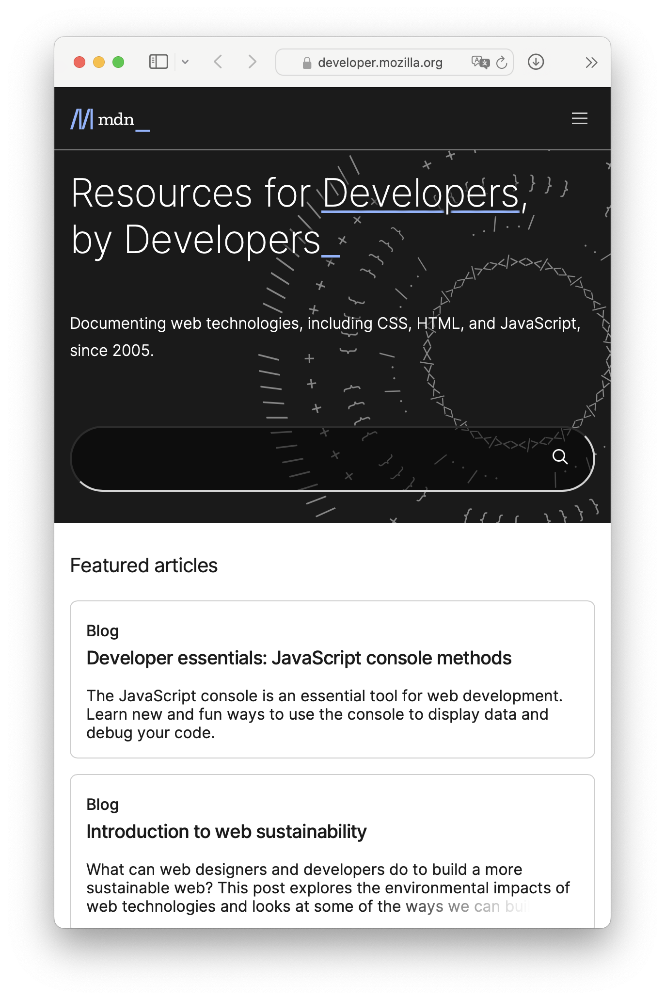
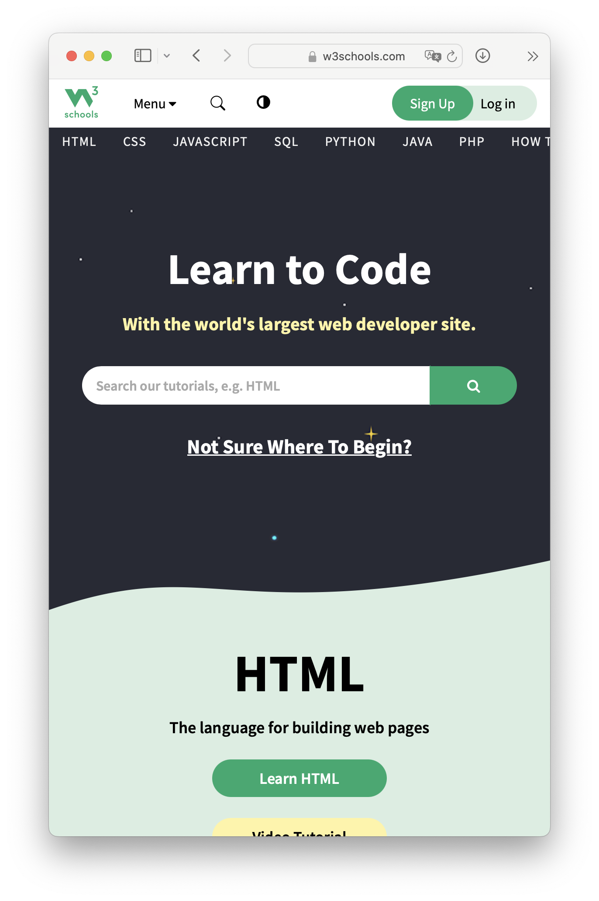
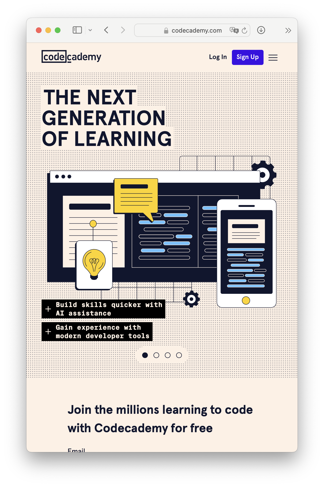
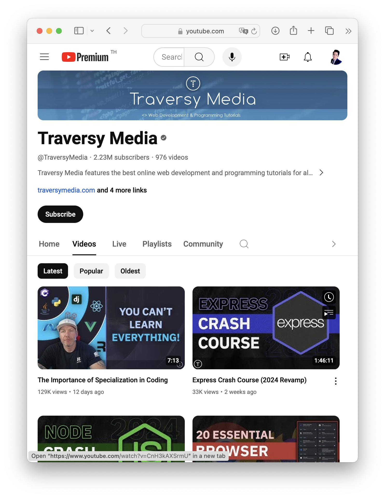
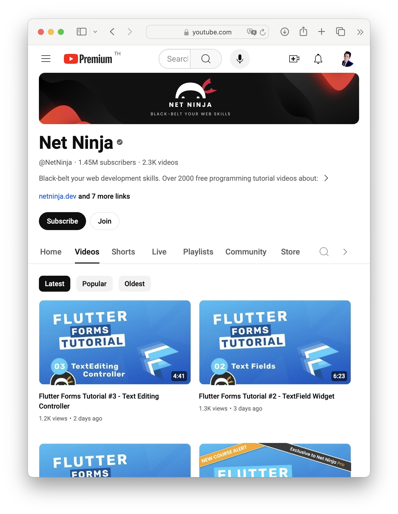
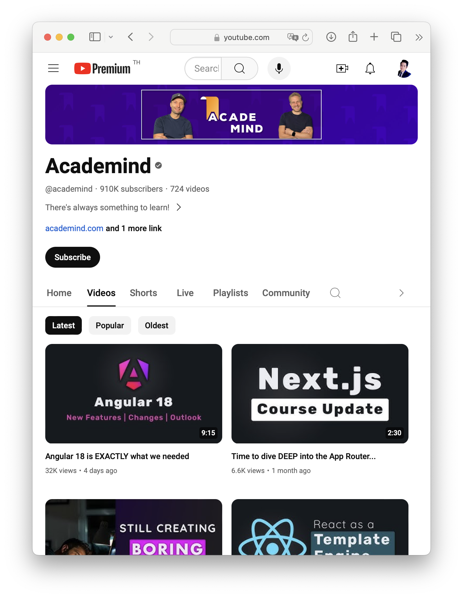

<!-- _class: titlepage -->

Supplement Learning Resources

Modern Website Development

R. Promkam and W.Kuangsatung

Department of Mathematics and Computer Science, RMUTT

---

# Books

## HTML and CSS: Design and Build Websites 
- By Jon Duckett
- A visually engaging introduction to HTML and CSS with clear explanations and practical examples.

---

# Books

## Learning Web Design: A Beginner's Guide to HTML, CSS, JavaScript, and Web Graphics 
- By Jennifer Niederst Robbins
- A comprehensive guide that covers the essentials of web design, including HTML and CSS, with hands-on exercises.

---

# Books

## HTML5: The Missing Manual 
- By Matthew MacDonald
- A detailed guide to HTML5, covering both basic and advanced topics with plenty of examples and tips.

---

# Tutorials and Courses

## Mozilla Developer Network (MDN)

- Comprehensive documentation and tutorials on HTML, CSS, and JavaScript.
- Website: [MDN Web Docs](https://developer.mozilla.org/)

---

# Tutorials and Courses

## W3Schools

- A popular platform for learning HTML, CSS, JavaScript, and other web technologies with interactive tutorials.
- Website: [W3Schools](https://www.w3schools.com/)

---

# Tutorials and Courses

## Codecademy

- Interactive courses on HTML, CSS, and web development fundamentals.
- Website: [Codecademy](https://www.codecademy.com/)

---

# Tutorials and Courses

## freeCodeCamp

- A non-profit platform offering a comprehensive curriculum on web development, including projects and certification.
- Website: [freeCodeCamp](https://www.freecodecamp.org)

---

# Videos

## Traversy Media (YouTube)

- Brad Traversy provides a wide range of tutorials on web development, including HTML, CSS, JavaScript, and more.
- Channel: [Traversy Media](https://www.youtube.com/user/TechGuyWeb)

---

# Videos

## The Net Ninja (YouTube)

- Shaun Pelling offers extensive tutorials on HTML, CSS, JavaScript, and web development frameworks.
- Channel: [The Net Ninja](https://www.youtube.com/channel/UCW5YeuERMmlnqo4oq8vwUpg)

---

# Videos

## Academind (YouTube)

- Detailed tutorials on web development technologies, including HTML, CSS, and modern JavaScript.
- Channel: [Academind](https://www.youtube.com/c/Academind)

